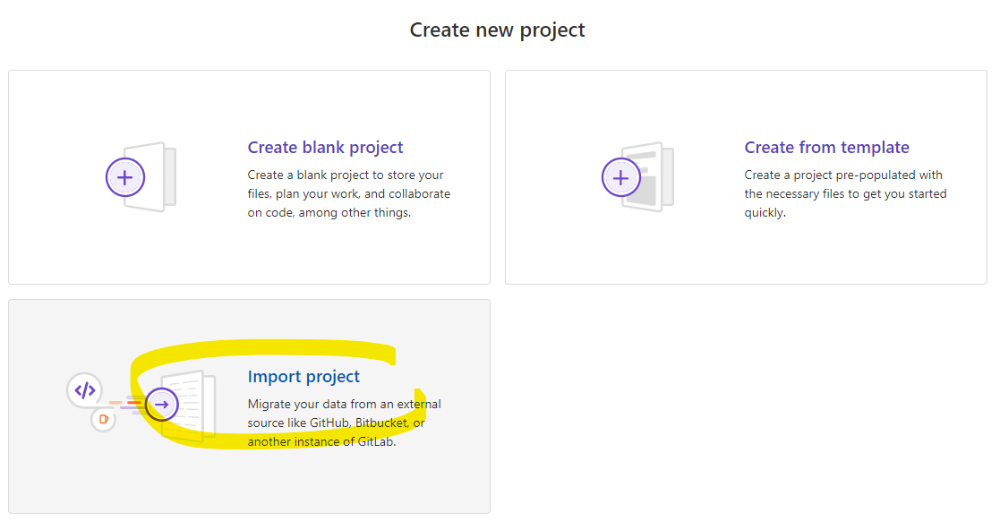
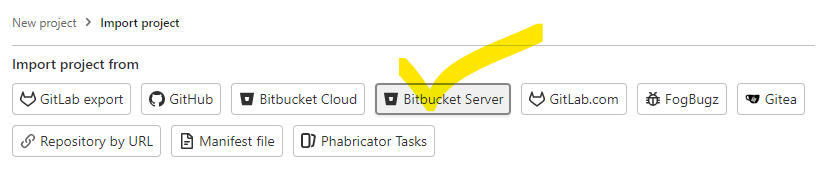
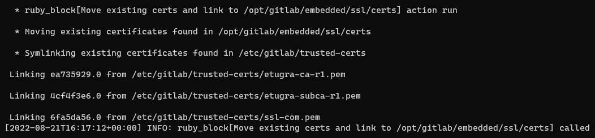

# GitLab'ın Kurulumu

Ayaklandırıp root kullanıcısının şifresini alalım:

```shell
docker-compose up -d
docker exec -it git grep 'Password:' /etc/gitlab/initial_root_password
```


Harici kaynaklardan kod havuzlarını çekebilmek için aşağıdaki ayarı (Admin Area > Network > Outbound requests > "Allow requests to the local network from web hooks and services") yapıyoruz:


# Yeni Proje (Bitbucket'tan İçeri Alacağız)






# Bitbucket Kod Havuzları

https://bitbucket.ulakhaberlesme.com.tr:8443/rest/api/1.0/repos?start=0&limit=25 Adresindeki listeye erişmek birinci gaye.
Bu sayfadan alınacak listeden seçtiğimiz kod havuzlarını Gitlab içine alacağız.


# Bitbucket Üstünde Kullanıcı Token'ı Oluşturmak

https://bitbucket.ulakhaberlesme.com.tr:8443/plugins/servlet/access-tokens/manage Adresinden TOKEN oluşturacağız.


# Hatanın Tespiti

Unable to connect to server: SSL_connect returned=1 errno=0 state=error: certificate verify failed (unable to get local issuer certificate)


```shell
curl https://bitbucket.ulakhaberlesme.com.tr:8443/repos?visibility=public
```


```shell
echo | /opt/gitlab/embedded/bin/openssl s_client -connect bitbucket.ulakhaberlesme.com.tr:8443
```


Çözümü:

Sertifikaları aşağıda anlatıldığı gibi 


Sorun giderildikten sonra:


## Firefox'tan Sertifikaların İndirilmesi

### Tüm Sertifikaların Zincir Olarak İndirilmesi ve curl İle Denenmesi

Önce sertifika zincirini tek dosya olarak indirip `/tmp/ulakhaberlesme-com-tr-chain.pem` olarak kaydedelim ve curl ile bir istek yapalım.


```shell
curl --cacert /tmp/ulakhaberlesme-com-tr-chain.pem https://bitbucket.ulakhaberlesme.com.tr:8443/rest/api/1.0/repos?start=0&limit=25
```


### Tüm Sertifikaları tek tek İndirilip ve openssl İle Denenmesi

Sertifikaların PEM hallerini indirip `/etc/gitlab/trusted-certs` dizinine yapıştıracağız.


Dosyaları `/etc/gitlab/trusted-certs` dizinine kopyalayım:


Dosyalar yapıştırıldı ama gitlab bu dosyaları taramadığı için henüz çalışmıyor:

```shell
echo | /opt/gitlab/embedded/bin/openssl s_client -connect bitbucket.ulakhaberlesme.com.tr:8443
```


Gitlab'ı tekrar ayarlarla başlatıp tekrar deneyeceğiz:

```shell
gitlab-ctl reconfigure
```

Çıktılarına baktığımızda sertifikaların gitlab tarafından işlendiğini görebiliriz:



Gitlab tekrar ayarlandığına göre openssl ile tekrar deneyebiliriz:


```shell
echo | /opt/gitlab/embedded/bin/openssl s_client -connect bitbucket.ulakhaberlesme.com.tr:8443
```


# Bitbucket'tan Repo'ların Çekilmesi


